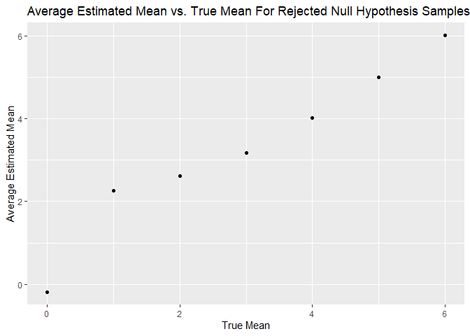

p8105_hw5_jdv2118
================
Justin Vargas

\#Loading Libraries

``` r
library(tidyverse)
library(dplyr)
library(broom)
```

    ## Warning: package 'broom' was built under R version 4.2.2

# Problem 3

The following code is used to create a simulation function with the
following design elements of n = 30 and sigma = 5.

``` r
simulation_function = function(n = 30, mu, sigma = 5) {
  
  x = rnorm(n, mean = mu, sd = sigma)
  t_test = t.test(x = x, alternative = "two.sided", conf.level =   0.95) %>%
  tidy() %>%
  select(estimate, p.value)
} 
```

The following code is a simulation of when mu = 0, 5000 datasets are
generated by the model, and the estimate and p-value are obtained from a
one-sample t-test.

``` r
mu_0_simulation = rerun(5000, simulation_function(mu = 0)) %>%
bind_rows()

mu_0_simulation
```

    ## # A tibble: 5,000 × 2
    ##    estimate p.value
    ##       <dbl>   <dbl>
    ##  1 -0.0801   0.916 
    ##  2 -0.00128  0.999 
    ##  3 -0.641    0.451 
    ##  4 -1.29     0.105 
    ##  5  1.58     0.0731
    ##  6 -1.51     0.172 
    ##  7 -0.440    0.595 
    ##  8  1.03     0.215 
    ##  9  1.03     0.371 
    ## 10 -0.544    0.559 
    ## # … with 4,990 more rows

The following code is a simulation for when mu is equal to 0 through 6,
5000 datasets are generated for each mu, and the estimate and p-value
are obtained from a one-sample t-test.

``` r
mu_sim = tibble(mu = c(0,1,2,3,4,5,6)) %>%
  mutate(output = map(.x = mu, ~rerun(5000,
  simulation_function(mu = .x))),
  result = map(output, bind_rows)) %>%
  select(-output) %>%
  unnest()
```

    ## Warning: `cols` is now required when using unnest().
    ## Please use `cols = c(result)`

``` r
mu_sim
```

    ## # A tibble: 35,000 × 3
    ##       mu estimate p.value
    ##    <dbl>    <dbl>   <dbl>
    ##  1     0  0.650    0.485 
    ##  2     0 -0.713    0.378 
    ##  3     0 -1.64     0.0592
    ##  4     0 -0.741    0.510 
    ##  5     0 -0.714    0.388 
    ##  6     0  0.867    0.283 
    ##  7     0 -0.243    0.834 
    ##  8     0  0.00703  0.994 
    ##  9     0 -0.223    0.811 
    ## 10     0  0.420    0.571 
    ## # … with 34,990 more rows

## Plot 1

The following code is used to produce a plot that shows the proportion
of times the null hypothesis was rejected and the true value of mu.
Based on the plot, one can observe that as the true mean increases, the
power also increases. Additionally, as the true mean increases, the
effect size also increases. Please note that the proportion of times the
null hypothesis was rejected becomes relatively stable at around 1 for a
true mean of 4, 5, and 6.

``` r
null_reject_plot = 
  mu_sim %>%
  group_by(mu) %>%
  summarize(number = n(),
  p_value = sum(p.value < 0.05),
  proportion_null_reject = p_value/number) %>%
  ggplot(aes(x = mu, y = proportion_null_reject)) + 
  geom_point() +
  labs(
    x = "True Mean", 
    y = "Proportion of Times the Null Hypothesis Was Rejected",
    title = "Proportion of Times the Null Hypothesis Was Rejected Vs. True Mean"
  )

null_reject_plot
```

<!-- -->

## Plot 2

``` r
average_true_mean_plot = 
  mu_sim %>%
  group_by(mu) %>%
  summarize(estimate_average = mean(estimate)) %>%
  ggplot(aes(x = mu, y = estimate_average)) + 
  geom_point() +
  labs(
    x = "True Mean", 
    y = "Average Estimated Mean", 
    title = "Average Estimated Mean Vs. True Mean For All Samples"
  )

average_true_mean_plot 
```

<!-- -->

## Plot 3

The sample average of mu across tests for which the null is rejected is
approximately equal to the true value of mu. However, it is important to
note that when the true mean is equal to 1, the average estimated mean
is about 2.25. It is also important to note that when the true mean is
equal to 2, the average estimated mean is about 2.5. All of the other
average estimated means are relatively more equal to the corresponding
true mean, such as 0, 3, 4, 5, and 6.

``` r
average_null_reject_plot =
  mu_sim %>%
  filter(p.value < 0.05) %>%
  group_by(mu) %>%
  summarize(estimate_average = mean(estimate)) %>%
  ggplot(aes(x = mu, y = estimate_average)) + 
  geom_point() +
  labs(
    x = "True Mean", 
    y = "Average Estimated Mean",
    title = "Average Estimated Mean vs. True Mean For Rejected Null Hypothesis Samples"
  )
  
average_null_reject_plot
```

<!-- -->
