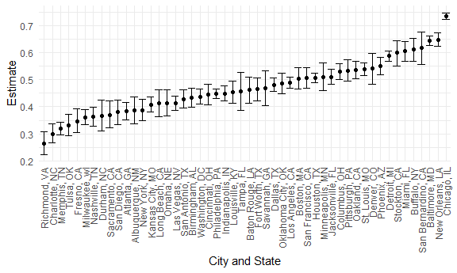

p8105_hw5_jdv2118
================
Justin Vargas

# Loading Libraries and Figure Options

``` r
library(tidyverse)

library(dplyr)

library(broom)

library(knitr)

opts_chunk$set(
  fig.width = 6,
  fig.asp = .6,
  out.width = "90%"
)
theme_set(theme_minimal() + theme(legend.position = "bottom"))
options(
  ggplot2.continuous.colour = "viridis",
  ggplot2.continuous.fill = "viridis"
)
scale_colour_discrete = scale_color_viridis_d
scale_fill_discrete = scale_fill_viridis_d
```

# Problem 1

The code chunk below imports the data in individual spreadsheets
contained in `./data/zip_data/`. To do this, I create a dataframe that
includes the list of all files in that directory and the complete path
to each file. As a next step, I `map` over paths and import data using
the `read_csv` function. Finally, I `unnest` the result of `map`.

``` r
full_df = 
  tibble(
    files = list.files("data/zip_data/"),
    path = str_c("data/zip_data/", files)
  ) %>% 
  mutate(data = map(path, read_csv)) %>% 
  unnest()
```

The result of the previous code chunk isn’t tidy – data are wide rather
than long, and some important variables are included as parts of others.
The code chunk below tides the data using string manipulations on the
file, converting from wide to long, and selecting relevant variables.

``` r
tidy_df = 
  full_df %>% 
  mutate(
    files = str_replace(files, ".csv", ""),
    group = str_sub(files, 1, 3)) %>% 
  pivot_longer(
    week_1:week_8,
    names_to = "week",
    values_to = "outcome",
    names_prefix = "week_") %>% 
  mutate(week = as.numeric(week)) %>% 
  select(group, subj = files, week, outcome)
```

Finally, the code chunk below creates a plot showing individual data,
faceted by group.

``` r
tidy_df %>% 
  ggplot(aes(x = week, y = outcome, group = subj, color = group)) + 
  geom_point() + 
  geom_path() + 
  facet_grid(~group)
```


This plot suggests high within-subject correlation – subjects who start
above average end up above average, and those that start below average
end up below average. Subjects in the control group generally don’t
change over time, but those in the experiment group increase their
outcome in a roughly linear way.

# Problem 2

``` r
raw_data = 
  read_csv("data/homicide_data.csv") 

homicide =
  raw_data %>% 
  mutate(
    city_state = str_c(city, state, sep = ", "),
    result = case_when(
      disposition == "Closed without arrest" ~ "unsolved",
      disposition == "Closed by arrest" ~ "solved",
      disposition == "Open/No arrest" ~ "unsolved")
  ) %>% 
  select(city_state, result) %>% 
  filter(city_state != "Tulsa, AL")
```

The raw data consists of 12 variables, which are uid, reported_date,
victim_last, victim_first, victim_race, victim_age, victim_sex, city,
state, lat, lon, and disposition. The raw data also consists of 52179
rows.

The following code is used to create a new dataframe with two new
variables, unsolved_homicides and total_homicides, which entail the
number of unsolved homicides and the total number of homicides,
respectively.

``` r
homicide_info = 
  homicide %>% 
  group_by(city_state) %>% 
  summarize(
    unsolved_homicides = sum(result == "unsolved"),
    total_homicides = n()
  )
```

The following code is used to estimate the proportion of homicides that
are unsolved for Baltimore, MD, through the use of a prop.test.

``` r
prop.test(
  homicide_info %>% 
  filter(city_state == "Baltimore, MD") %>% 
  pull(unsolved_homicides), 
  homicide_info %>% 
  filter(city_state == "Baltimore, MD") %>% 
  pull(total_homicides)) %>% 
  tidy()
```

    ## # A tibble: 1 × 8
    ##   estimate statistic  p.value parameter conf.low conf.high method        alter…¹
    ##      <dbl>     <dbl>    <dbl>     <int>    <dbl>     <dbl> <chr>         <chr>  
    ## 1    0.646      239. 6.46e-54         1    0.628     0.663 1-sample pro… two.si…
    ## # … with abbreviated variable name ¹​alternative

``` r
results = 
  homicide_info %>% 
  mutate(
    prop_tests = map2(.x = unsolved_homicides, .y = total_homicides,          ~prop.test(x = .x, n = .y)),
    tidy_tests = map(.x = prop_tests, ~tidy(.x))
  ) %>% 
  select(-prop_tests) %>% 
  unnest(tidy_tests) %>% 
  select(city_state, estimate, conf.low, conf.high)

results
```

    ## # A tibble: 50 × 4
    ##    city_state      estimate conf.low conf.high
    ##    <chr>              <dbl>    <dbl>     <dbl>
    ##  1 Albuquerque, NM    0.386    0.337     0.438
    ##  2 Atlanta, GA        0.383    0.353     0.415
    ##  3 Baltimore, MD      0.646    0.628     0.663
    ##  4 Baton Rouge, LA    0.462    0.414     0.511
    ##  5 Birmingham, AL     0.434    0.399     0.469
    ##  6 Boston, MA         0.505    0.465     0.545
    ##  7 Buffalo, NY        0.612    0.569     0.654
    ##  8 Charlotte, NC      0.300    0.266     0.336
    ##  9 Chicago, IL        0.736    0.724     0.747
    ## 10 Cincinnati, OH     0.445    0.408     0.483
    ## # … with 40 more rows

``` r
homicide_plot =
  results %>% 
  mutate(city_state = fct_reorder(city_state, estimate)) %>% 
  ggplot(aes(x = city_state, y = estimate)) +
  geom_point() + 
  geom_errorbar(aes(ymin = conf.low, ymax = conf.high)) + 
  theme(axis.text.x = element_text(angle = 90, vjust = 0.5, hjust = 1)) + labs(
    x = "City and State", 
    y = "Estimate",
)

homicide_plot
```



# Problem 3

The following code is used to create a simulation function with the
following design elements of n = 30 and sigma = 5.

``` r
set.seed(3)

simulation_function = function(n = 30, mu, sigma = 5) {
  
  x = rnorm(n, mean = mu, sd = sigma)
  t_test = t.test(x = x, alternative = "two.sided", conf.level =   0.95) %>%
  tidy() %>%
  select(estimate, p.value)
} 
```

The following code is a simulation of when mu = 0, 5000 datasets are
generated by the model, and the estimate and p-value are obtained from a
one-sample t-test.

``` r
mu_0_simulation = rerun(5000, simulation_function(mu = 0)) %>%
bind_rows()

mu_0_simulation
```

    ## # A tibble: 5,000 × 2
    ##    estimate p.value
    ##       <dbl>   <dbl>
    ##  1  -1.17    0.126 
    ##  2   0.140   0.879 
    ##  3   1.39    0.0461
    ##  4   0.0262  0.970 
    ##  5  -1.29    0.218 
    ##  6   1.59    0.164 
    ##  7  -0.761   0.480 
    ##  8   0.376   0.676 
    ##  9   1.21    0.219 
    ## 10   0.854   0.315 
    ## # … with 4,990 more rows

The following code is a simulation for when mu is equal to 0 through 6,
5000 datasets are generated for each mu, and the estimate and p-value
are obtained from a one-sample t-test.

``` r
mu_sim = tibble(mu = c(0,1,2,3,4,5,6)) %>%
  mutate(output = map(.x = mu, ~rerun(5000,
  simulation_function(mu = .x))),
  result = map(output, bind_rows)) %>%
  select(-output) %>%
  unnest()

mu_sim
```

    ## # A tibble: 35,000 × 3
    ##       mu estimate p.value
    ##    <dbl>    <dbl>   <dbl>
    ##  1     0  -0.567    0.498
    ##  2     0   0.0829   0.910
    ##  3     0   0.0715   0.930
    ##  4     0   0.955    0.344
    ##  5     0  -0.324    0.730
    ##  6     0  -0.787    0.453
    ##  7     0   0.236    0.789
    ##  8     0   0.0283   0.978
    ##  9     0  -0.713    0.359
    ## 10     0   0.597    0.456
    ## # … with 34,990 more rows

## Plot 1

The following code is used to produce a plot that shows the proportion
of times the null hypothesis was rejected and the true value of mu.
Based on the plot, one can observe that as the true mean increases, the
power also increases. Additionally, as the true mean increases, the
effect size also increases. Please note that the proportion of times the
null hypothesis was rejected becomes relatively stable at around 1 for a
true mean of 4, 5, and 6.

``` r
null_reject_plot = 
  mu_sim %>%
  group_by(mu) %>%
  summarize(number = n(),
  p_value = sum(p.value < 0.05),
  proportion_null_reject = p_value/number) %>%
  ggplot(aes(x = mu, y = proportion_null_reject)) + 
  geom_point() +
  labs(
    x = "True Mean", 
    y = "Proportion of Times the Null Hypothesis Was Rejected",
    title = "Proportion of Times the Null Hypothesis Was Rejected Vs. True Mean"
  )

null_reject_plot
```


## Plot 2

``` r
average_true_mean_plot = 
  mu_sim %>%
  group_by(mu) %>%
  summarize(estimate_average = mean(estimate)) %>%
  ggplot(aes(x = mu, y = estimate_average)) + 
  geom_point() +
  labs(
    x = "True Mean", 
    y = "Average Estimated Mean", 
    title = "Average Estimated Mean Vs. True Mean For All Samples"
  )

average_true_mean_plot 
```


## Plot 3

The sample average of mu across tests for which the null is rejected is
approximately equal to the true value of mu. However, it is important to
note that when the true mean is equal to 1, the average estimated mean
is about 2.25. It is also important to note that when the true mean is
equal to 2, the average estimated mean is about 2.5. All of the other
average estimated means are relatively more equal to the corresponding
true mean, such as 0, 3, 4, 5, and 6.

``` r
average_null_reject_plot =
  mu_sim %>%
  filter(p.value < 0.05) %>%
  group_by(mu) %>%
  summarize(estimate_average = mean(estimate)) %>%
  ggplot(aes(x = mu, y = estimate_average)) + 
  geom_point() +
  labs(
    x = "True Mean", 
    y = "Average Estimated Mean",
    title = "Average Estimated Mean vs. True Mean For Rejected Null Hypothesis Samples"
  )
  
average_null_reject_plot
```


